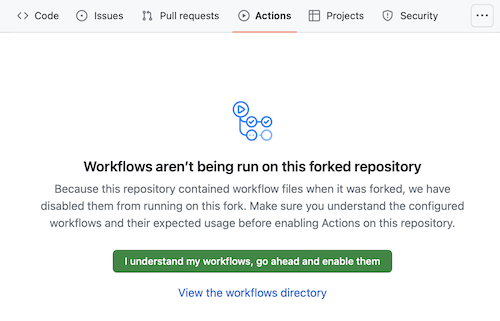
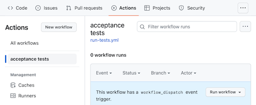

# Hello, World

The "Hello, World" program is traditionally the very first program
that people write when learning a computer programming
language. It is an exceptionally simple program, with no purpose other
than to display the phrase "Hello, World!" when executed. It is
intended to expose new programmers to the syntax of a language, to the
tools required to author and run a program, and to other elements of
the software development environment.

## Open this assignment in a codespace

To open this repository in a codespace, click the green `<> Code` button
above, in the panel that opens, go to the `Codespaces` tab, and click the
`Create codespace on main` button.

## Submitting this assignment

You submit this assignment by pushing the changes you make in your
codespace back to this repository.

The repository is set up to automatically run acceptance tests
whenever you push changes. However, you first need to grant permission
for them to run. Click the `Actions` tab at the top of the page, and
then agree to enable workflows.

Now you can try running the tests manually. Select `acceptance tests`
in the sidebar on the left, and then click the `Run workflow` button
on the right (you want the default, from branch `main`).

The test should fail, since you haven't written any code to make it
pass yet!

Once you've done the above, you should be able to see the current
status of the tests below.

