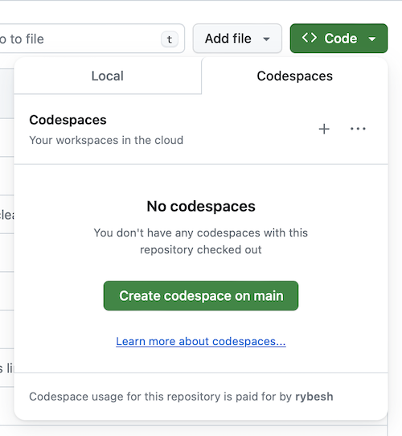

# Hello, World

The "Hello, World" program is traditionally the very first program
that people write when learning a computer programming
language. It is an exceptionally simple program, with no purpose other
than to display the phrase "Hello, World!" when executed. It is
intended to expose new programmers to the syntax of a language, to the
tools required to author and run a program, and to other elements of
the software development environment.

To open this repository in a codespace, click the green `<> Code` button
above, in the panel that opens, go to the `Codespaces` tab, and click the
`Create codespace on main` button.

